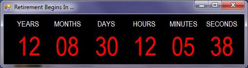

# Countdown Clock

Countdown Clock is a small Visual Basic .NET Windows Forms program that displays the years, months, days, hours, minutes, and seconds remaining until a user-specified date and time.



Years ago I used a small program called **RCT** (Retirement Countdown Timer) that displayed a countdown until retirement. RCT depended on the old Visual Basic 5.0 run-time libraries, so I created this Visual Basic .NET replacement. Its appearance is deliberately similar to RCT, but Countdown Clock is general-purpose: the target date, time, and window-title message are configurable.

## Configuration

Countdown Clock reads its target from [`EndDate.txt`](EndDate.txt). The first line must have this form:

```text
YYYY-MM-DD HH:MM:SS,Message
```

For example:

```text
2099-01-01 00:00:00,Retirement Begins In ...
```

The date and time are interpreted as **local wall-clock time in the computer's current local time zone**. No time-zone field is required in `EndDate.txt`. The text after the first comma is displayed in the program's title bar; additional commas may appear in that text.

When the file is read, Countdown Clock validates the local date and time and converts it to UTC using the local time-zone rules. A target that falls in a daylight-saving transition gap (an invalid local time) or in a repeated hour (an ambiguous local time) is rejected rather than silently mapped to the wrong instant.

`EndDate.txt` is loaded from the same directory as the application. The SDK project automatically copies it to build and publish output. When the target instant has been reached, the countdown timer stops.

## Modern .NET project

The project has been modernized from the traditional .NET Framework 4.8 Visual Basic project format to an **SDK-style Windows Forms project targeting .NET 10** (`net10.0-windows`).

The modernization removes the old `App.config` and `My Project/` machinery. Startup is explicit in [`Program.vb`](Program.vb), while application and assembly settings are kept in the compact SDK-style [`CountdownClock.vbproj`](CountdownClock.vbproj).

The startup code deliberately retains the original Microsoft Sans Serif 8.25-point default font and system-aware DPI mode so that the fixed-size form remains visually close to the original application.

.NET 10 is a Long Term Support release. See Microsoft's [.NET support policy](https://dotnet.microsoft.com/platform/support/policy) and [Windows Forms migration guidance](https://learn.microsoft.com/dotnet/desktop/winforms/migration/).

## Building from source

Use Visual Studio 2026 with the .NET desktop development workload and a .NET 10 SDK, or build from a Developer Command Prompt:

```text
dotnet build CountdownClock.sln -c Release
```

Normal Visual Studio and SDK-generated directories and per-user files such as `.vs/`, `bin/`, `obj/`, `*.suo`, and `*.user` are intentionally excluded from version control by [`.gitignore`](.gitignore).

### Publishing a Windows executable

A framework-dependent, single-file Windows x64 build can be produced with:

```text
dotnet publish CountdownClock.vbproj -c Release -r win-x64 --self-contained false -p:PublishSingleFile=true -p:DebugType=None -p:DebugSymbols=false
```

That build requires the .NET 10 Desktop Runtime on the target computer. To publish a larger self-contained executable that carries its own .NET runtime, use:

```text
dotnet publish CountdownClock.vbproj -c Release -r win-x64 --self-contained true -p:PublishSingleFile=true -p:DebugType=None -p:DebugSymbols=false
```

`EndDate.txt` remains a separate editable companion file and is copied into the publish directory automatically.

## Prebuilt executable

A prebuilt Windows executable is retained in [`release/`](release/). The executable currently in that directory is the **pre-modernization .NET Framework 4.8 build**, retained for convenience until the modern .NET 10 source is published on Windows. Its accompanying `Countdown Clock.exe.config` belongs only to that .NET Framework build.

Once a .NET 10 build is published, replace the legacy files in `release/` with the new published executable and its `EndDate.txt`; a modern .NET build does not use the old `.exe.config` file. See [`release/README.md`](release/README.md).

## Date calculation

The countdown is decomposed sequentially into years, months, days, hours, minutes, and seconds using .NET `DateTime` calendar operations. This handles variable month lengths and Gregorian leap years.

The target from `EndDate.txt` is retained as a local civil time for the calendar decomposition, but it is also converted to UTC using `TimeZoneInfo`. Each timer update obtains `DateTime.UtcNow` and uses the UTC values to determine whether the target has actually been reached. This avoids relying on implicit local-time conversions while preserving the intended calendar-style display.

The program does **not** explicitly model leap seconds.

The calculation approach was based on the C# implementation `jwg.cs` from the [date-difference project](https://github.com/jwg4/date-difference).

## Repository layout

```text
Countdown-Clock/
├── .gitignore
├── Countdown_Clock_screencap.png
├── CountdownClock.Designer.vb
├── CountdownClock.resx
├── CountdownClock.sln
├── CountdownClock.vb
├── CountdownClock.vbproj
├── EndDate.txt
├── LICENSE
├── Program.vb
├── README.md
└── release/
    ├── Countdown Clock.exe
    ├── Countdown Clock.exe.config
    ├── EndDate.txt
    └── README.md
```

A separate GitHub Pages site is not required: GitHub renders the screenshot directly in this README.

## License

Countdown Clock is licensed under the **GNU General Public License, version 3 or later**. See [`LICENSE`](LICENSE).
